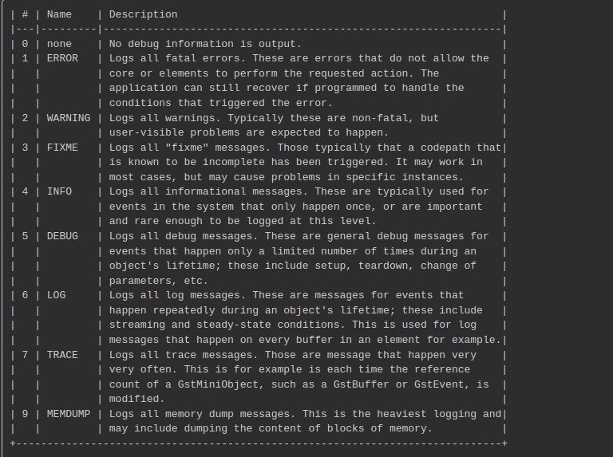

# GSTREAMER

GStreamer, çoklu ortam işleme çerçevesidir ve ses, video ve diğer multimedya verilerini işlemek, kodlamak, dönüştürmek ve akış oluşturmak için kullanılan bir yazılım kütüphanesidir.

**Elements:** Medya işleme işlevselliğini sağlayan temel yapı taşlarıdır. Bu öğeler, medya dosyalarını okumak, kodlamak, dönüştürmek, sesi işlemek, videoyu oynatmak gibi çeşitli görevleri yerine getirir.


**Pad:** Öğeler arasındaki veri akışı pad'lar aracılığıyla gerçekleşir. Pads, öğeler arasındaki bağlantıları ve veri akışını tanımlar. Bir pad, bir öğenin işlevselliğini ve rolünü belirler. Örneğin, bir öğe genellikle giriş pad'ına veri alır ve çıkış pad'ından veri gönderir.

**GST_DEBUG:** Debug işleminin derecesini berliler. `gst-launch-1.0 --gst-debug-help` 



**GstQuery:** Verinin sorgulanmasını sağlar.

- **`gst-discoverer-1.0` :** GStreamer Multimedya Çerçevesi'nde medya dosyalarının özelliklerini ve içeriğini keşfetmek için kullanılan bir araçtır.

- **`gst-inspect-1.0` :** öğe sınıflarını ve öğe plugin'lerini incelemek ve hakkında bilgi almak için kullanılır.

```bash
gst-inspect nvarguscamerasrc 
gst-discoverer-1.0  rtsp://192.168.144.25:8554/main.264
```

- source -> filter -> sink şeklinde kodlaması yapılır.
- `gst-launch-1.0 videotestsrc ! ximagesink` gstreamer kontrol etmek için kullanılır.
- **`-v ya da --verbose` :** Çıktının daha ayrıntılı olmasını sağlar.
- `sudo service nvargus-daemon restart` kamera servisini resetlememizi sağlar.
- `v4l2-ctl --list-devices` bağlı olan çihazları listeler
- `v4l2-ctl -d /dev/video0 --all` belirtilen çihaz hakkında detaylı bilgi verir.
- `v4l2-ctl -d /dev/video0 --list-formats-ext` en temel ve anlaşılır bilgilerini gösterir.
- `export DISPLAY=:0` ssh ile doğrudan bilgisayarda yazılamadığı durumlarda kullanılır.

- Örnek terminal kodları -> CLI.md
- C ile nasıl programlandığına bakmak için -> c_syntax.md 

### Basic:
> **tutorial_1.c:** For GStreamer, hello world

> **tutorial_2.c:** Source - sink - pipeline

> **tutorial_3.c:** Demuxer: Audio and video were separated.

> **tutorial_4.c:** Time management

> **tutorial_5.c:** GUI toolkit integration

> **tutorial_6.c:** Media formats and Pad Capabilities `gst-inspect-1.0`

> **tutorial_7.c:** Multithreading and Pad Availability

> **tutorial_8.c:** Short-cutting the pipeline

> **tutorial_9.c:** Media information gathering

> **tutorial_10.c:** Streaming

> **tutorial_11.c:** Playback speed

> **tutorial_12.c:** Streaming


### Playback

> **tutorial_1.c:** Playbin usage

> **tutorial_2.c:** Subtitle management

> **tutorial_3.c:** Short-cutting the pipeline

> **tutorial_4.c:** Progressive streaming

> **tutorial_5.c:** Color Balance

> **tutorial_6.c:** Audio visualization

> **tutorial_7.c:** Custom playbin sinks


### Build

```bash
# Terminal üzerinden c dosyasını build etmek için kullanılan komutlar.
gcc main.c -o main `pkg-config --cflags --libs gstreamer-1.0`
gcc main.c -o main `pkg-config --cflags --libs gtk+-3.0 gstreamer-1.0`
```

### Error Resolutions

- **fatal error:** gtk/gtk.h: No such file or directory `#include <gtk/gtk.h>`

```bash
sudo apt update
sudo apt upgrade
sudo apt install libgtk-3-dev
```